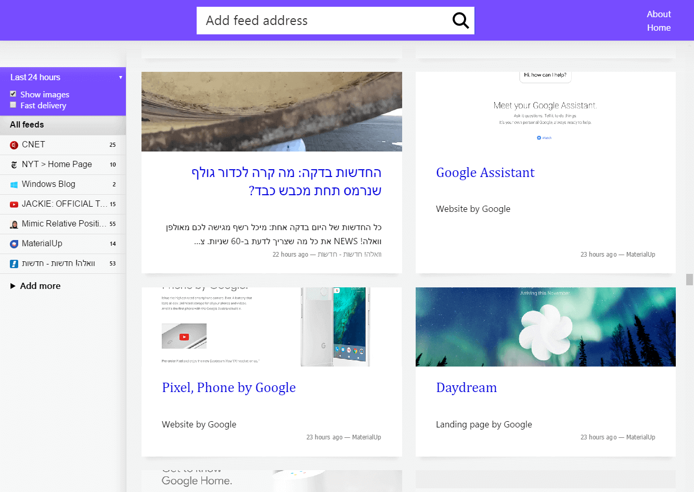

# [Feedler](https://lab.laukstein.com/feedler)

Feedler is a personalized news reader, made specialy for [10K Apart](https://a-k-apart.com) contest.

## How to use

**Type a feed address and click Enter.** 
Supports RSS2.0, RSS1.0 and ATOM feed formats, LTR/RTL articles. 
By default Feedler returns the last 3 days news, is customizable in UI. 
After added the first feed, it will display also images for article is has, is customizable in UI.

## Benifits

* Optimized for 10kB inital page load (till user adds feeds)
* Accessiable without JavaScript
* Cached with ServiceWorker
* Used HTML5 features
* Cloudinary CDN

## Server requirements

Apache 2.4 + rewrite_module or IIS Web.config, PHP 5.4 + dom, curl and SimpleXML. 
Directory [`~cache`](~cache) must be writable, run `chmod -R 777 ~cache`

[`config.php`](config.php) contains configuration flags. Optimized images delivered trough Cloudinary CDN, if whenever exceeded CDN bandwidth, set `$imagePrefix` value to **null**.

## Storage

* Web assets like CSS are stored in Web Cache Storage
* Served feeds are stored for 5 minutes in `~cache`
* The user session is stored in `session.save_path` till PHP `session.gc_maxlifetime` expired

## License

Released under the [CC BY-NC-ND 4.0 License](LICENSE).
